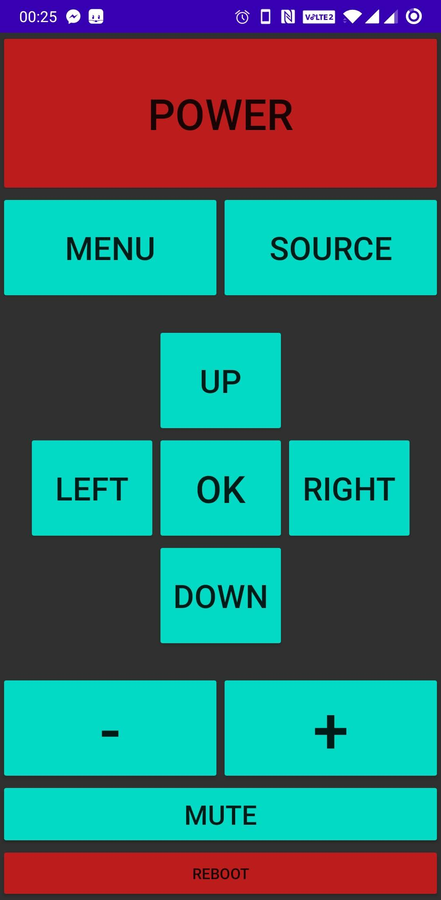
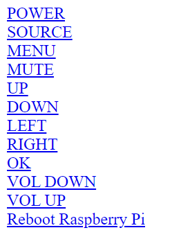

# Android-TV-Remote

Android IR LED TV Remote App. Control a non-smart TV using your phone and a Raspberry Pi server.

## What is it for?

If your TV is not a smart TV but you would still like to control it from your phone, this is the right project for you.

It uses a Raspberry Pi to generate IR signals (place the RPi somewhere close to the TV) and a node.js based application to receive commands from a custom Android app. It is fully customizable.

## Contents

1. AndroidApp
This directory contains an Android Studio project ready to build your own Remote TV Android App!

2. index.html and index.js
Files used to host a website that allows you to control the TV through web.
index.js is a node.js application. That serves index.html which is a website for manual control through a web browser.

3. lirc
This directory contains a copy of my LIRC config files and my remote config file.
They should **not** be used unless you have a problem with your lirc (it can be quite tricky to set up) and want to have a look at a working config.

## Prerequisites

You will need the following:

- a Raspberry Pi
- an IR LED
- 2 resistors: 33Ω and 820Ω
- one NPN transistor
- an Android phone

## Hardware setup

First, connect the IR LED to your RPi. 

See [this post](https://www.raspberrypi.org/forums/viewtopic.php?p=800127&sid=10af4f4b4fe489a65d2879af05c5c379#p800127) for a working circuit.

The 820Ω resistor going into the transistor base should be connected to GPIO 18.

## Software setup

1. Install LIRC on your Raspberry Pi
- if you have issues on a Raspberry Pi 4 running Kernel 4.19, [this should help](https://www.raspberrypi.org/forums/viewtopic.php?f=28&t=235256)

2. Create a LIRC config file for your remote to copy its key presses using `irrecord`. [See here how to do it](https://learn.adafruit.com/using-an-ir-remote-with-a-raspberry-pi-media-center/using-other-remotes)

3. Test the **new** remote config using `irsend` command to make sure you can control the TV using RPi.
for example: `irsend send_once` *config_name* `KEY_POWER`

4. Install node.js, npm, and express

5. Start hosting the index.js web application
`node index.js`
You might need to run it as a root user (*sudo*).

6. Visit your Raspberry Pi's IP address in a web browser - you should see a website:

That means the node.js server is up and running.

7. Try clicking the links and check if you can control the TV from the website.

8. If you want, you can set up a systemd service to run the server all the time, e.g. when you reboot your Pi.

9. Once you have the RPi running a node.js server, and you can control your TV from the website, you're almost done. It's time to build an Android app now!

10. Download and install Android Studio and open the TV Remote project located in AndroidApp directory.

11. Change `0.1.2.3` in line 26 (MainActivity.java) to the IP address of your Raspberry Pi.
You can also change the button layout and colours (activity_main.xml), or add and remove buttons in MainActivity.java.

12. Press CTRL + F9 to build the app. Copy it to your phone, install, and enjoy your brand new TV remote!

## TODO
- [ ] full guide on how to get everything set up from A to Z